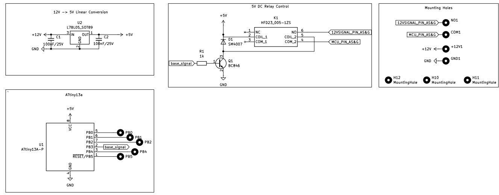
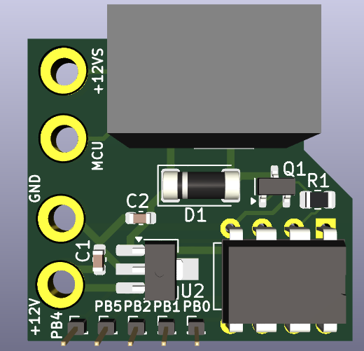

# ATTINY13A Automatic Stop And Go Off Switch

This project implements an automatic Stop and Go Off Switch for the AS&G (Auto Stop & Go) system in Mitsubishi ASX and Citroën C4 Aircross. The switch is designed to enhance user convenience by automatically disabling the AS&G system after ignition.

## Features

- **Automatic AS&G System Override**: Automatically disables the AS&G system after time defined by user.
- **Compact Design**: Designed with a small PCB footprint suitable for automotive integration.
- **Low Power Consumption**: Utilizes power-efficient components to minimize current draw.
- **Easy Installation**: Plug-and-play solution compatible with Mitsubishi ASX and Citroën C4 Aircross.

# Components

| Reference | Value         | Footprint                              |
|-----------|---------------|----------------------------------------|
| C1, C2    | 100nF/25V     | Capacitor_SMD:C_0603_1608Metric       |
| D1        | SM4007        | Diode_SMD:D_MELF                      |
| K1        | HFD23_005-1ZS | relays:HFD230051ZS                    |
| Q1        | BC846         | Package_TO_SOT_SMD:SOT-23             |
| R1        | 1k            | Resistor_SMD:R_0805_2012Metric        |
| U1        | ATtiny13A-P   | Package_DIP:DIP-8_W7.62mm             |
| U2        | L78L05_SOT89  | Package_SO:SOIC-8_3.9x4.9mm_P1.27mm  |

 # Dependencies
 SOON

# Schematic

  

# PCB View

  

# Casing
SOON

